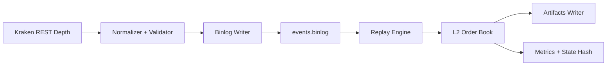

# marketdata-cpp

Deterministic **L2 market data capture -> normalize -> binlog -> replay** engine in C++20.

This repository focuses on low-latency systems engineering with deterministic replay, benchmark/profiling discipline, and reproducible artifacts.

## Implementation Summary

- Live public L2 ingestion from Kraken depth feed (`capture`)
- Canonical fixed-point event model (`MarketEvent`, 64-byte)
- Snapshot + incremental delta event stream in deterministic binlog
- In-memory L2 price-level book with best bid/ask + top-N support
- Deterministic replay and state-hash equivalence checks
- `artifacts/metrics.json`, `artifacts/metadata.json`, `artifacts/book_samples.csv`, `artifacts/report.md`
- Tests + CI + benchmarks + perf scripts + Docker

## Architecture



## Make Targets

- `make build`
- `make test`
- `make bench`
- `make capture`
- `make replay`
- `make demo`
- `make clean`

## Single-Command Demo

```bash
make demo
```

Default demo behavior:
1. captures 60 seconds of live Kraken L2 depth (`XBTUSD`)
2. writes deterministic binlog (`artifacts/captured.binlog`)
3. replays binlog and verifies deterministic state hash
4. writes all required artifacts
5. runs benchmarks

Override capture settings:

```bash
make demo CAPTURE_SECONDS=120 CAPTURE_INTERVAL_MS=500 SYMBOL=XBTUSD DEPTH=25
```

## Artifact Contract

`artifacts/metadata.json`:
- `git_sha`
- `build`
- `config`
- `dataset`
- `dataset_hashes`
- `run_started_utc`
- `run_finished_utc`

`artifacts/metrics.json`:
- replay throughput (`msgs/sec`)
- p50/p95/p99 apply latency
- deterministic state hash information

Other outputs:
- `artifacts/book_samples.csv`
- `artifacts/report.md`
- `artifacts/bench_book.json`
- `artifacts/bench_replay.json`

## Assumptions and Limitations

- Ingestion uses Kraken public depth REST polling to build a real-time L2 snapshot+delta stream.
- Single-machine, CPU-only, Linux-first.
- Not a production exchange gateway.
- Determinism applies to replay of a fixed captured binlog.

## Profiling

```bash
bash scripts/run_perf.sh artifacts/captured.binlog
bash scripts/make_flamegraph.sh
```

## Docker

```bash
docker build -t marketdata-cpp .
docker run --rm marketdata-cpp
```
