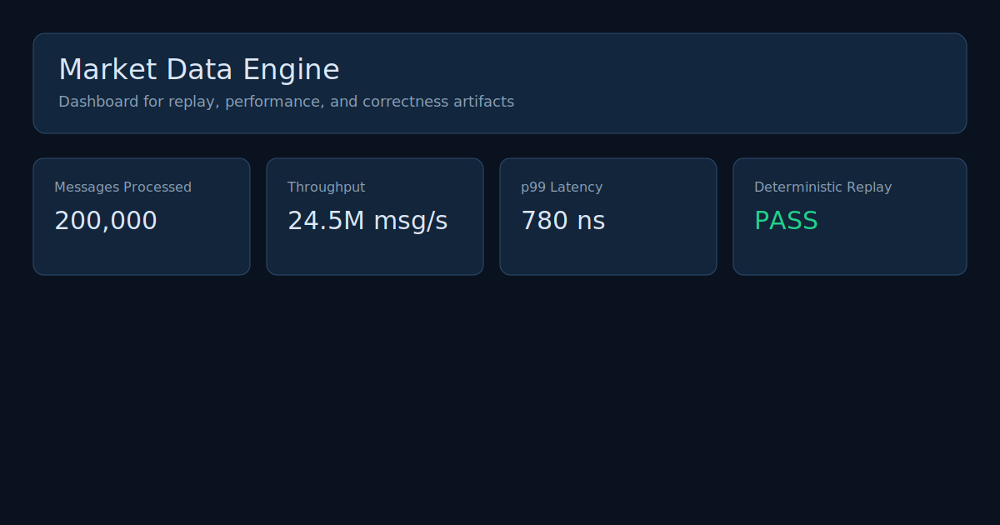

# marketdata-pages

Static Cloudflare Pages website for **Market Data Engine** artifacts from `marketdata_cpp`.

This repository is intentionally frontend-only: it does not rebuild or run the C++ engine. It renders published artifact files and shows backend deterministic replay, L2 updates, and performance outputs.

## Relationship To `marketdata_cpp`

- `marketdata_cpp` (existing backend) generates artifacts offline/CI.
- `marketdata-pages` (this repo) reads those files from `public/data/latest/` and visualizes them.
- No backend API, database, or server-side functions are required.

## What The Site Shows

Routes:
- `/` Home dashboard
- `/replay` autoplay top-of-book / spread / depth snapshots
- `/performance` latency + throughput + benchmark/profiler summaries
- `/correctness` deterministic replay and equivalence checks
- `/architecture` pipeline + provenance
- `/artifacts` raw artifact inventory and links

## Expected Artifact Inputs

Placed under `public/data/latest/`:
- `metadata.json`
- `metrics.json`
- `summary.json`
- `benchmark_summary.json`
- `correctness_report.json`
- `state_hash.json`
- `tob_timeseries.json`
- `spread_timeseries.json`
- `depth_snapshots.json`
- `profiler_summary.json`
- `replay_summary.txt`
- `book_samples.csv`

Not all are required for rendering. Missing files show explicit “not published” states.

## Local Development

```bash
npm install
npm run dev
```

Build static output:

```bash
npm run build
```

Output directory: `dist`

## Artifact Publication Workflow (from backend)

From this repo root:

```bash
npm run prepare:data -- ../marketdata_cpp/artifacts
npm run validate:artifacts
```

This copies recognized files into `public/data/latest/` and writes `public/data/latest/manifest.json`.

## Example Data / Zero-Setup Demo

The site works even without backend artifacts by falling back to `public/examples/`.

Regenerate examples:

```bash
npm run generate:examples
```

## Deploy To Cloudflare Pages

### Option A: Git Integration

1. Push this repo to GitHub.
2. Create Cloudflare Pages project and connect the repository.
3. Build command: `npm run build`
4. Build output directory: `dist`

### Option B: Direct Upload / Wrangler

```bash
npm install
npm run build
npx wrangler pages deploy dist --project-name marketdata-pages
```

## CI

GitHub Actions (`.github/workflows/ci.yml`) runs:
- install
- example generation
- artifact validation
- typecheck
- build

## Screenshots / Sample Output

Home mock preview:



Sample raw artifacts:
- [`sample-metrics.json`](public/examples/sample-metrics.json)
- [`sample-summary.json`](public/examples/sample-summary.json)
- [`sample-tob-timeseries.json`](public/examples/sample-tob-timeseries.json)
- [`sample-correctness.json`](public/examples/sample-correctness.json)

## Limitations

- This site does not execute replay logic itself; it only visualizes artifacts.
- If backend schema changes significantly, update `src/lib/parsers.ts` adapters.
- Chart quality depends on the granularity of published timeseries artifacts.

## Commands

- `npm run dev`
- `npm run build`
- `npm run typecheck`
- `npm run validate:artifacts`
- `npm run prepare:data -- <input-dir>`
- `npm run generate:examples`
